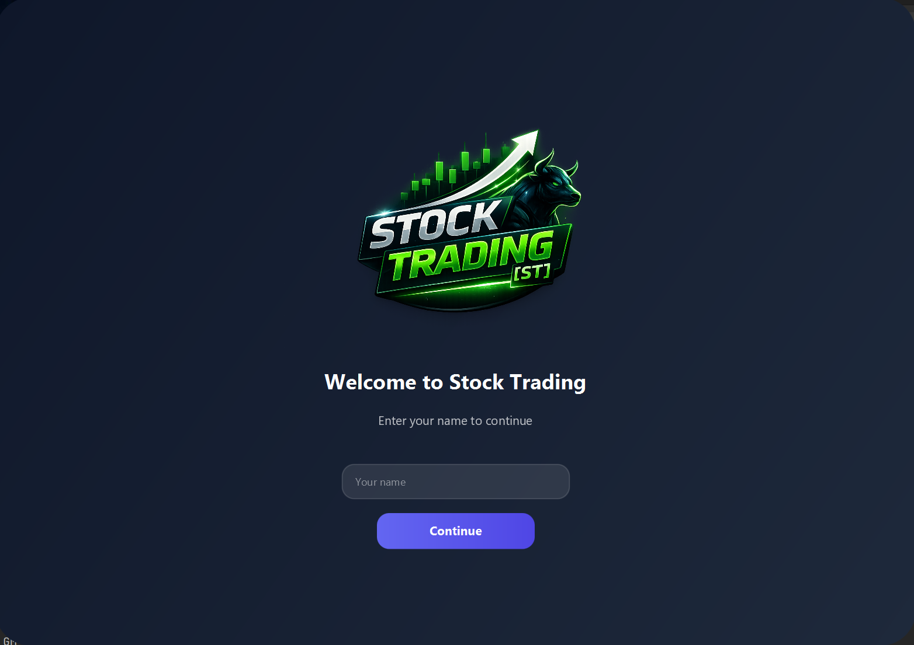
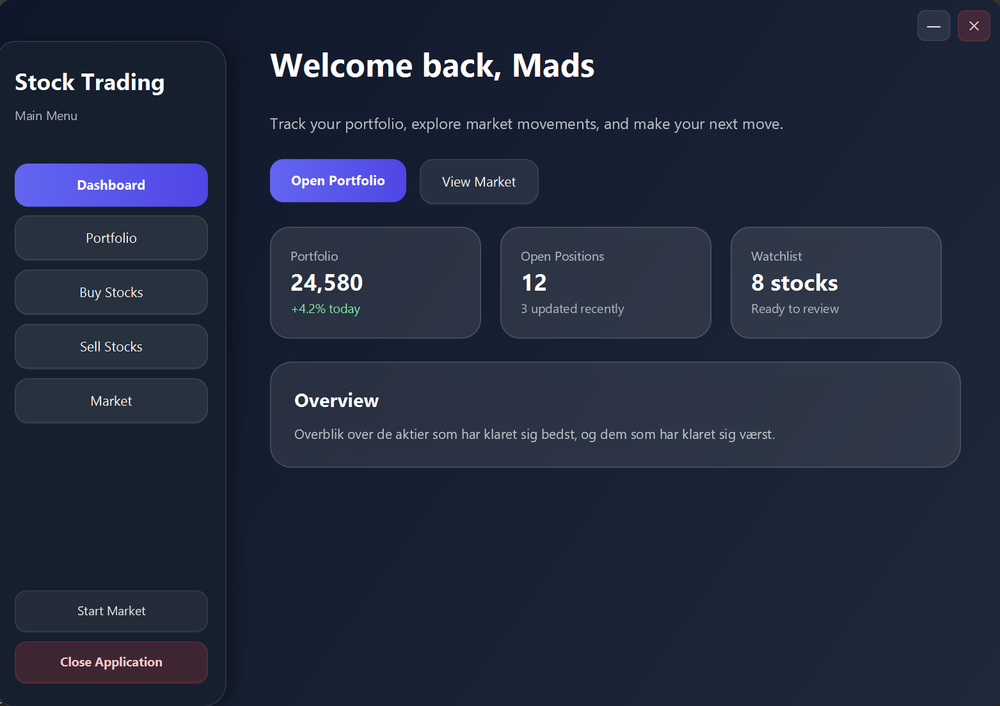
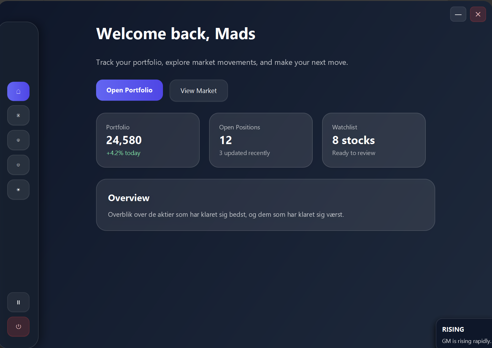
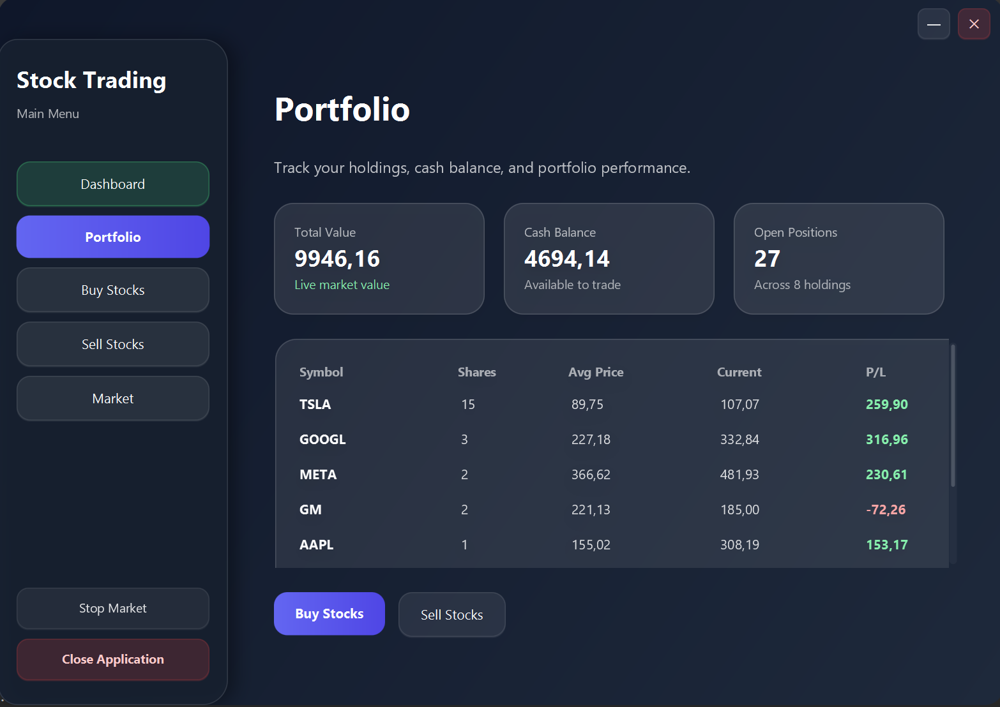
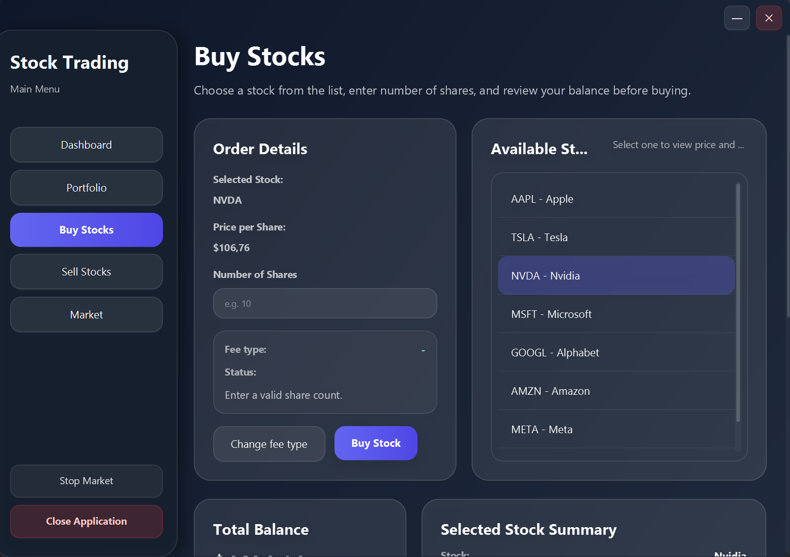
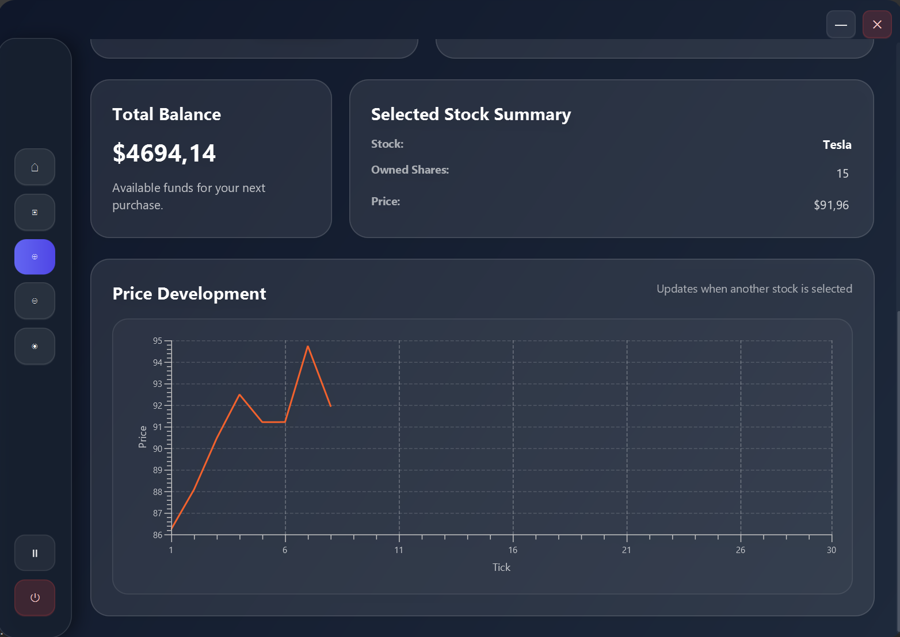
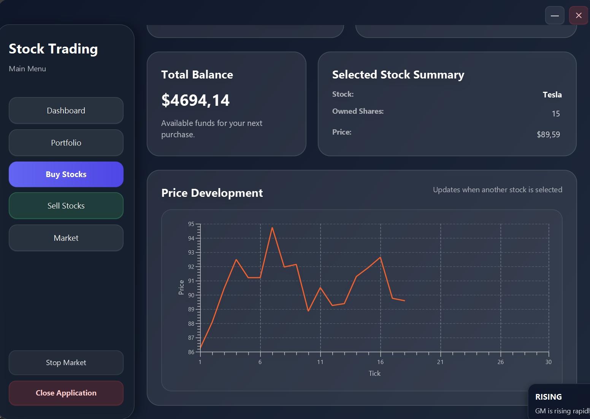
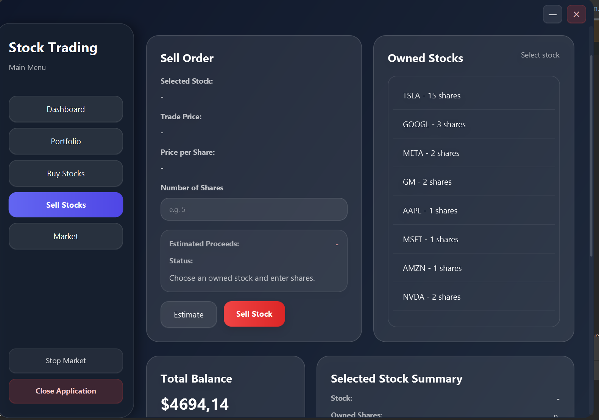
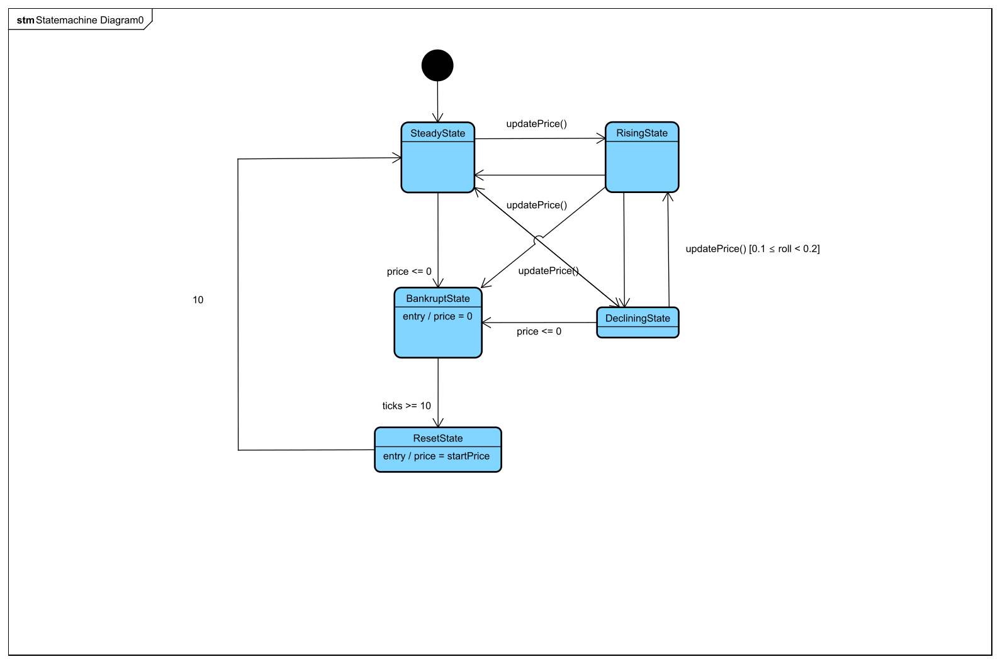

### A project in Software Design and Test

# Stock Trading Game

Stock Trading Game is a JavaFX desktop application developed as part of a Software Design and Test assignment. The application simulates a small stock trading environment where a user can view the market, buy and sell stocks, manage a portfolio and follow stock price changes over time.

The project focuses on layered architecture, separation of concerns, design patterns, file-based persistence and automated tests for core trading behavior.

## Project Scope

This project was built for Software Design and Test, and should be understood as a learning-focused simulation rather than a complete trading product. The trading domain was mainly used as a concrete frame for working with maintainable application structure, testability and design patterns.

The project includes a JavaFX desktop application with buy/sell flows, portfolio handling, transaction history, local PSV-based persistence, stock price simulation, alerts and market state changes. Around those flows, the project explores a layered architecture with a clear separation between presentation, business logic and persistence. The application uses an ApplicationContext, ControllerFactory and ViewManager to keep object creation, dependency wiring and navigation more controlled instead of spreading that responsibility across the UI.

A large part of the project is about applying design principles and patterns in practice. The implementation includes MVVM to reduce controller responsibility, DAO interfaces to separate business logic from file storage, Unit of Work to handle commit/rollback-like behavior, Adapter pattern for logging and UI notifications, Observer pattern for stock market updates and listeners, State pattern for stock price behaviour, and Strategy pattern for interchangeable fee calculation. These choices were not added to make the project look bigger, but to practise SOLID principles such as Single Responsibility, Open/Closed, Dependency Inversion and Dependency Injection in a concrete codebase.

Testing was also a central part of the project. The project includes unit tests, integration tests and scenario-based test documentation. The tests cover important trading behaviour such as buying, selling, invalid quantities, insufficient funds, transaction handling, rollback/commit behaviour and file logger integration. Test design ideas such as boundary value analysis, equivalence partitioning, AAA/FIRST principles, ZOMBIES and scenario testing were used to connect the code to the theory from the course.

The project is therefore not meant to behave like a real trading platform with live markets, users or financial security. Its value is mainly that it shows how a non-trivial Java application can be structured, tested, documented and explained through architecture, patterns and design decisions.

## Features

The application includes functionality for:

- viewing available stocks in a stock market overview
- buying stocks for a portfolio
- selling owned stocks
- viewing portfolio balance and owned stocks
- tracking transactions
- storing stock, portfolio and transaction data in local files
- simulating stock price changes through market states
- showing notifications and alerts in the JavaFX user interface
- calculating trading fees with interchangeable fee strategies

## Screenshots

### 1. Starting Page



### 2. Dashboard View



### 3. Dashboard View - Updated Market



### 4. Portfolio View



### 5. Buy Stock View



### 6. Buy Stock View - Stock Selection



### 7. Buy Stock View - Trade Input



### 8. Sell Stock View



## Technologies

The project uses:

- Java
- JavaFX
- FXML
- CSS
- JUnit 5
- IntelliJ IDEA project structure
- PSV files for local persistence

## Project Structure

```text
StockTrading/
|-- Assignment/
|   |-- src/
|   |   |-- presentation/             # JavaFX application, controllers, view models and navigation
|   |   |-- business/                 # Services, DTOs, stock market logic and fee strategies
|   |   |-- entities/                 # Core domain entities
|   |   |-- persistence/              # DAO interfaces and file-based implementations
|   |   |-- shared/                   # Configuration and logging
|   |   `-- provided/                 # Provided helper classes
|   |-- resources/
|   |   |-- fxml/                     # JavaFX views
|   |   |-- css/                      # Styling for the user interface
|   |   `-- images/                   # Images used by the application
|   |-- test/
|   |   `-- src/                     # Unit and integration tests
|   `-- Documentation/
|       |-- Artifacts/                # State machine and sequence diagrams
|       |-- ClassDiagram/             # Class diagrams from the assignment work
|       `-- ScenarioTest/             # Scenario testing documentation
|-- data/                            # Local PSV data files
|-- lib/                             # JUnit libraries
|-- logs/                            # Runtime log files
|-- README.md
`-- StockTradingGame.iml
```

## Architecture

The project is organized into multiple layers.

### Presentation

The `presentation` layer contains the JavaFX application and the user interface logic.

Important parts include:

- `MainApp.java`, which starts the JavaFX application
- controllers for the different FXML views
- view models for dashboard, portfolio, stock market, buy and sell flows
- navigation and application context classes
- notification classes for displaying stock alerts and user messages

### Business

The `business` layer contains the main application logic.

It includes services for:

- buying and selling stocks
- managing portfolios
- updating stock prices
- handling stock alerts
- storing and loading game state
- calculating transaction fees

The fee system is implemented with strategy classes such as flat fee, percentage fee and volume-based fee strategies.

### Entities

The `entities` package contains the core domain objects:

- `Stock`
- `Portfolio`
- `OwnedStock`
- `Transaction`
- `StockPriceHistory`

### Persistence

The `persistence` layer uses DAO interfaces and file-based implementations. Data is stored locally in PSV files inside the `data/` folder.

The main data files are:

- `stocks.psv`
- `portfolios.psv`
- `ownedstocks.psv`
- `transactions.psv`
- `stock_price_history.psv`

### Shared

The `shared` package contains common configuration and logging utilities used across the application.

## Analysis

### State Machine Diagram



## Design

### Class Diagram


### Buy Stock Sequence Diagram


## Testing

The project contains both unit tests and integration tests under `Assignment/test`.

Examples of tested areas include:

- buying stocks
- selling stocks
- trading service behavior
- boundary value analysis
- equivalence partitioning
- rollback and commit behavior through Unit of Work
- file logger integration

The project uses JUnit 5, and the required JUnit libraries are located in the `lib/` folder.

## How to Run the Project

The project is set up as an IntelliJ IDEA Java project.

1. Open the `StockTrading` folder in IntelliJ IDEA.
2. Make sure JavaFX is configured for the project.
3. Make sure the libraries in the `lib/` folder are added if tests need to be run.
4. Run the main class:

```text
Assignment/src/presentation/MainApp.java
```

The application starts by loading the welcome popup view and then opens the JavaFX user interface.

## Documentation

Additional documentation can be found in:

```text
Assignment/Documentation/
```

This folder contains analysis and design artifacts, including state machine diagrams, class diagrams, sequence diagrams and scenario testing material.

## Notes

- The application uses local file-based storage and does not require a database.
- Runtime logs are stored in the `logs/` folder.
- Compiled output in `out/` is not required for understanding the source code.
- The project is primarily focused on software design, test techniques and maintainable Java architecture.


